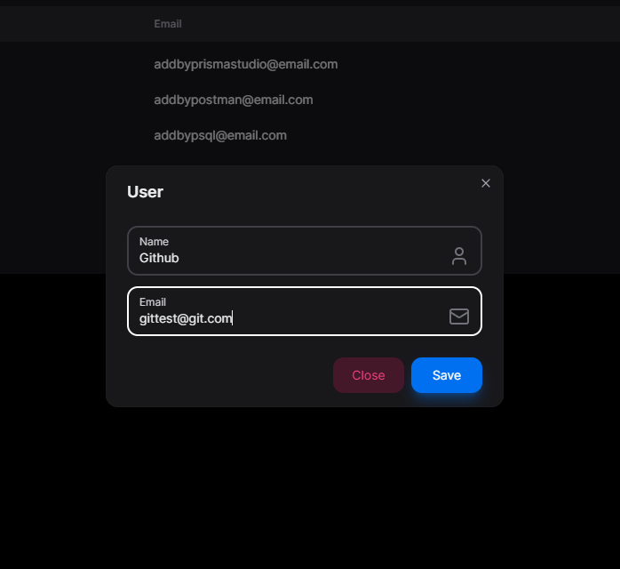
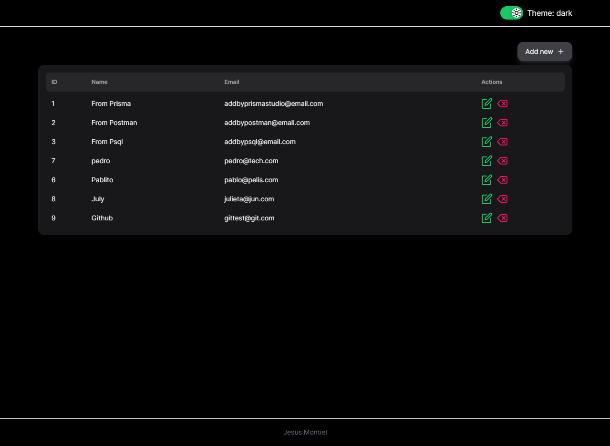
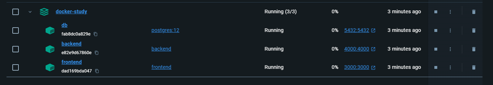

  <a href="" rel="noopener">
<p align="center">
 </a>
</p>

<h3 align="center">Docker Estudio</h3>

<div align="center">

[]()
[](https://github.com/3xp1o1t/docker-estudio/issues)
[](https://github.com/3xp1o1t/docker-estudio/pulls)
[](/LICENSE)

</div>

---

<p align="center">Proyecto para estudiar Docker con Node.js y NextJs</p>

<a href="" rel="noopener">
<p align="center">
 </a>
 </a>
</p>

## 📝 Table of Contents

- [Acerca de](#about)
- [Guía Inicio](#guia_inicio)
- [Despliegue](#deployment)
- [Uso](#usage)
- [Construido con](#built_using)
- [TODO](../TODO.md)
- [Contribuir](../CONTRIBUTING.md)
- [Autor](#authors)
- [Agradecimientos](#acknowledgement)

## 🧐 Acerca de <a name = "about"></a>

Proyecto para estudiar docker, en este ejemplo dockerizar una aplicacion de NextJs como frontend y Node.js como backend, a su vez utilizando postgresql y prisma ORM para las
tablas de la base de datos.

## 🏁 Guia de inicio <a name = "guia_inicio"></a>

Estas instrucciones te permitirán tener una copia del proyecto funcionando en tu máquina local para propósitos de desarrollo y pruebas. Ver [deployment](#deployment) para notas sobre cómo desplegar el proyecto en un sistema activo.

### Prerequisites

Requisitos para funcionar hasta el momento modo desarrollo

- Docker

Compilar la imagen, iniciar los servicios y la migración

```bash
docker compose build
docker compose up -d backend
docker compose up -d db
docker exec -it backend npx prisma migrate dev --name init
```

Notas de aprendizaje

- Listar imagenes ejecutandose/existentes

```bash
docker ps -a
```

- Iniciar un servicio del archivo compose.yaml
  - Descargar la imagen del servicio y configurar.
  - Donde -d permite liberar la consola donde se ejecuto el cmd

```bash
docker compose up -d <nombre del servicio>
ex: docker compose up -d db # run db service
```

- Interactuar con un servicio, ejemplo Postgres

```bash
docker exec -it <service> <params>
docker exec -it db psql -U postgres # start db psql with user postgres
```

- Compilar un contenedor

```bash
# Requiere un archivo compose.yaml
docker compose build
```

- Usando prisma es posible ejecutar la migración una vez iniciado el contenedor

```bash
# después de compilar el servicio de backend
docker compose up -d backend
# verificar si funciona
docker ps -a
# ejecutar la migración
docker exec -it backend npx prisma migrate dev --name init
# verificar en el servicio de postgresql
postgres=# \dt || \l
# select de valores
select * from "User"; #Importante las "" en el nombre de la tabla.
```

- Dockerizar un proyecto de NextJs

Al ser un proyecto que no sera desplegado en vercel, el output standalone
deja hacer lo que queramos con el código

```js
//next.config.js
/** @type {import('next').NextConfig} */
const nextConfig = {
  output: 'standalone',
};

module.exports = nextConfig;
```

Posteriormente, agregar los archivos de _.dockerignore_ y _frontend.dockerfile_ a la carpeta del frontend similar al backend.

El archivo _frontend.dockerfile_ utiliza la misma estructura del ejemplo en su github oficial

<https://github.com/vercel/next.js/blob/canary/examples/with-docker/Dockerfile>

Simplemente remplazamos la linea donde usa _yarn_ por npm en caso sea necesario

Posteriormente agregar el servicio al archivo compose.yaml

Al final, hacemos un build de nuevo y levantamos el servicio.

```bash
docker compose build
docker compose up -d frontend
```

### Instalación

Guía de instalación/inicio del proyecto

```bash
docker compose up -d frontend
# Si el volumen de la BD no existe, este comando lo creara
# y posteriormente hay que ejecutar la migración de prisma
docker exec -it backend npx prisma migrate dev --name init
```

Verificar que este ejecutándose

```
docker ps -a
```

Docker ejecutándose

<a href="" rel="noopener">
  <p align="center">
  </a>
</p>

## 🔧 Pruebas <a name = "tests"></a>

TODO agregar pruebas tal vez al front/back

### Conceptos avanzados de las pruebas

```
TODO ejemplo de test
```

## 🎈 Uso <a name="usage"></a>

Una vez iniciado el contenedor, visitar <http://localhost:3000>

## 🚀 Despliegue <a name = "deployment"></a>

TODO despliegue a un servidor

## ⛏️ Construido con <a name = "built_using"></a>

- [Docker](https://www.mongodb.com/) - Contenedor
- [Postgresql](https://postgresql.com/) - base de datos
- [Express](https://expressjs.com/) - Framework servidor
- [NextJs](https://vuejs.org/) - Framework web
- [NodeJs](https://nodejs.org/en/) - Backend
- [NextUi](https://nextui.org) - Librería UI
- [NextThemes](https://www.npmjs.com/package/next-themes) - Temas para Next UI
- [Header](https://leviarista.github.io/github-profile-header-generator/) - Header Repo

## ✍️ Autor <a name = "authors"></a>

- [@3xp1o1t](https://github.com/3xp1o1t) - Autor del repo
- [@Francesco](https://www.youtube.com/@francescociulla) - Autor original del curso

Contribuidores [contribuidores](https://github.com/3xp1o1t) who participated in this project.

## 🎉 Agradecimientos <a name = "acknowledgement"></a>

- Gracias al curso de francesco
